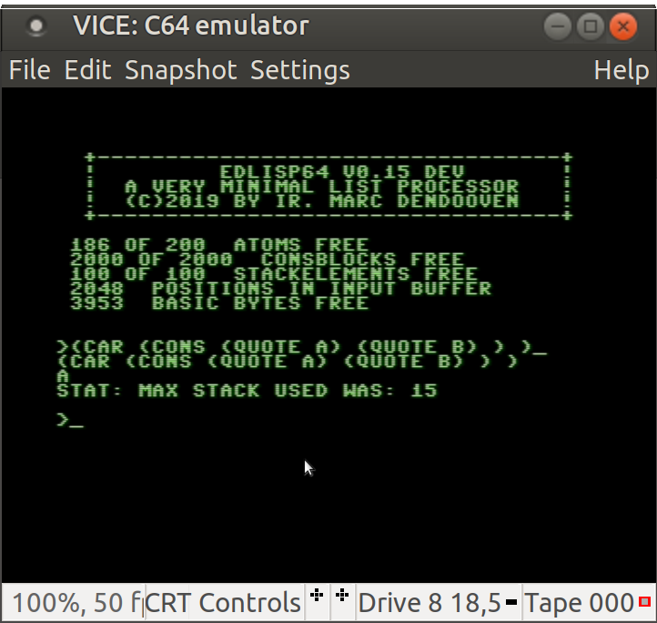

# EDlisp64
a very minimal list processor for the c64 in BASIC.   
It is very slow, but it works. (you can always use warp mode in vice...)   
implemented are: nil,#t,quote,cond,car,cdr,cons,atom?,eq? and lambda.  
console commands: define,ctx,exit and free.  
  
not implemented: numbers, garbage collection, tail recursion optimisation, ...  
I will probably not continue this program in basic. consider it as a proof of concept.    

